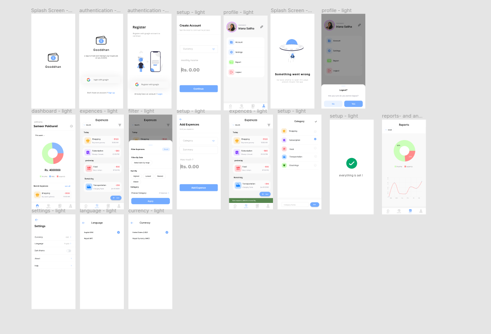
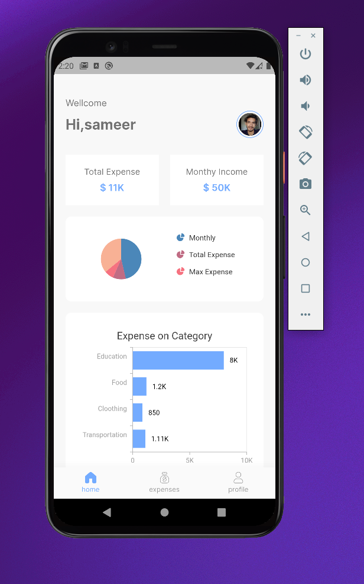
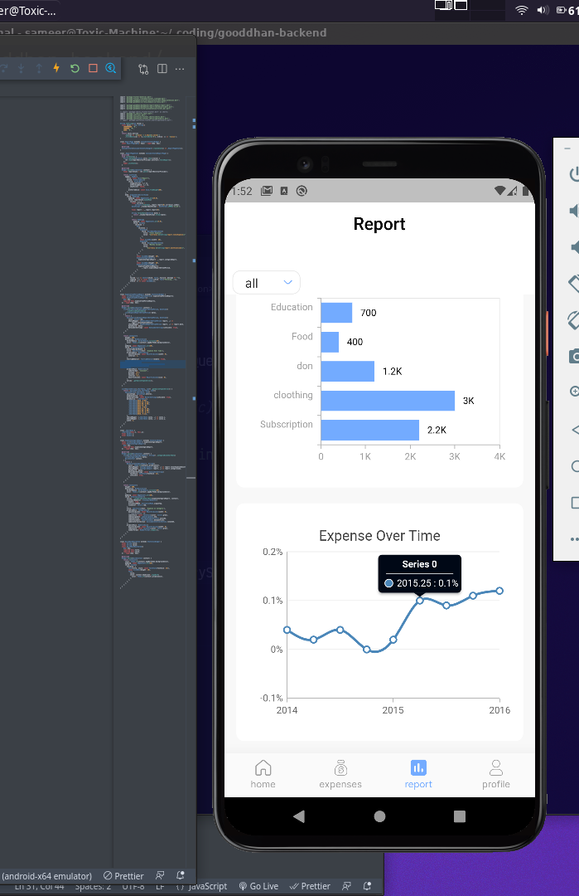
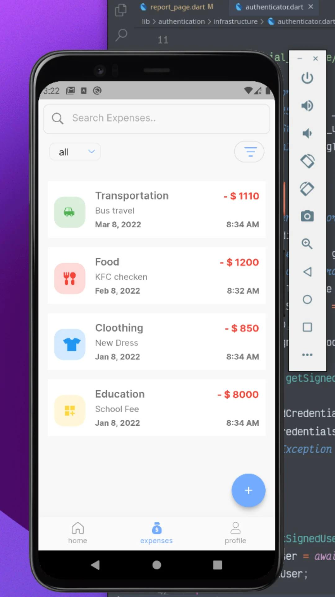
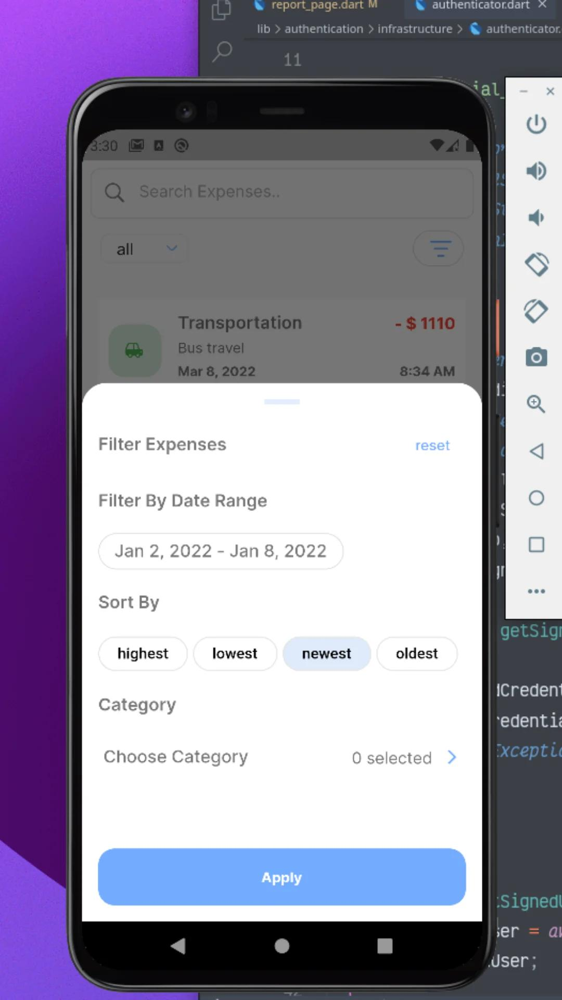

# repo_viewer

> Budget tracking application budget tracking app enables you to monitor how much of your budget has been spent over time.
application that helps to keep an accurate record of your money inflow and outflow.

#


## Live applciation: [Play Store Link](https://play.google.com/store/apps/details?id=sameer.gooddhanapp.com)

### Cloning Repo

Using Https:

```bash
git clone https://github.com/samirpokharel/Eazeal.git
```

## Using SSH ([Setup SSH](https://ramankarki.hashnode.dev/what-is-ssh-or-why-it-is-useful-or-how-to-setup-ssh-keys-on-github-and-bitbucket)):

```bash
git clone git@github.com:samirpokharel/Eazeal.git
```

## Getting Dependency

```bash
flutter pub get
```

## Freezed Code Generation

```bash
flutter pub run build_runner watch --delete-conflicting-outputs
```


## Flutter launcher icon Generator command

```bash
$ flutter pub run flutter_launcher_icons:main
```

## Flutter native splash Generator command

```bash
$ flutter pub run flutter_native_splash:create
```

## Flutter buid apk command

```bash
$ flutter build apk
```


## Design Links
https://www.figma.com/file/KHuzPzedPOTc3KWxPAFxW8/gooddhan-project?node-id=0%3A1



# Screenshoots





